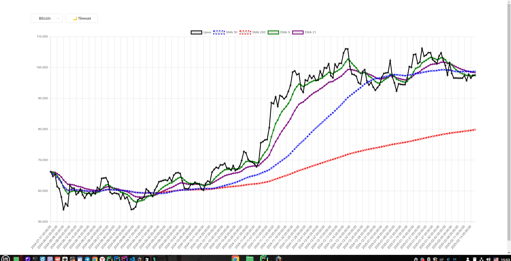
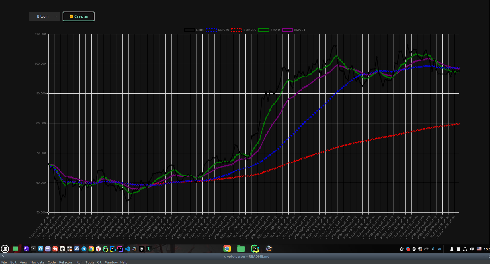

# 🚀 Crypto Dashboard 📊

Крипто-дэшборд на **Vue 3 + Naive UI + Flask**, который отображает **графики криптовалют** с индикаторами **SMA и EMA**.  
Поддерживает **тёмную/светлую тему**, кэширование данных и анимацию.

---

## 🔥 Функционал
- ✅ **Графики цен криптовалют** (Bitcoin, Ethereum, BNB)  
- ✅ **Индикаторы** SMA 50, SMA 200, EMA 9, EMA 21  
- ✅ **Переключение тёмной/светлой темы** 🌙  
- ✅ **Лоадер при загрузке данных** ⏳  
- ✅ **Кэширование запросов для быстрой работы**  

---

## 📦 Установка и запуск

### 1️⃣ Клонируем репозиторий
```bash
git clone https://github.com/roman140176/crypto-dashboard.git
cd crypto-dashboard
```

### 2️⃣ Запуск Backend (Flask)
```bash
cd backend
python3 -m venv venv  # Создаём виртуальное окружение
source venv/bin/activate  # Активируем его
pip install -r requirements.txt  # Устанавливаем зависимости
python app.py  # Запускаем сервер
```
🚀 Flask теперь работает на `http://127.0.0.1:5000/api/data?coin=bitcoin`

---

### 3️⃣ Запуск Frontend (Vue 3)
```bash
cd frontend/crypto-frontend
npm install  # Устанавливаем зависимости
npm run dev  # Запускаем Vue
```
🚀 Открываем `http://localhost:5173` в браузере

---

## 🔧 Технологии
- **Vue 3** + **Naive UI** 🎨  
- **Flask (Python 3)** 🐍  
- **Chart.js** 📊  
- **Axios** (для API-запросов)  
- **CoinGecko API** (исторические данные)  

---

## 📸 Скриншоты
| 🌞 Светлая тема  | 🌙 Тёмная тема  |
|-----------------|-----------------|
|  |  |

---

## 🚀 Развертывание
Можно деплоить на:
- **Vercel / Netlify** (Frontend)
- **Railway / Render / Heroku** (Backend)

---

## 📌 TODO (что можно улучшить)
- [ ] Добавить **RSI, MACD** 📊
- [ ] Сделать **адаптивность** для мобильных 📱
- [ ] Добавить поддержку **других криптовалют** 🔥

---


😎 **Happy Coding!** 🚀

